# [KEYCLOAK with Spring Boot & Angular | Step by Step Guide](https://www.youtube.com/watch?v=Ppkys9dKadA&list=PL41m5U3u3wwk0xrfl0FK--idljxVR2Dnx&index=4)

Tomado del canal de youtube de **Bouali Ali**.

---

En este curso de Spring Boot Angular, aprenderá cómo integrar `Keycloak` con `Spring Boot` y la aplicación `Angular`.
Recorriendo todas las configuraciones: creating a realm, client, users, roles, groups, localization,
social authentication, keycloak events, etc.

---

## Flujo de autenticación de Keycloak

A continuación se muestra de manera general cómo van a interactuar nuestras aplicaciones de Angular, Spring Boot y
Keycloak.

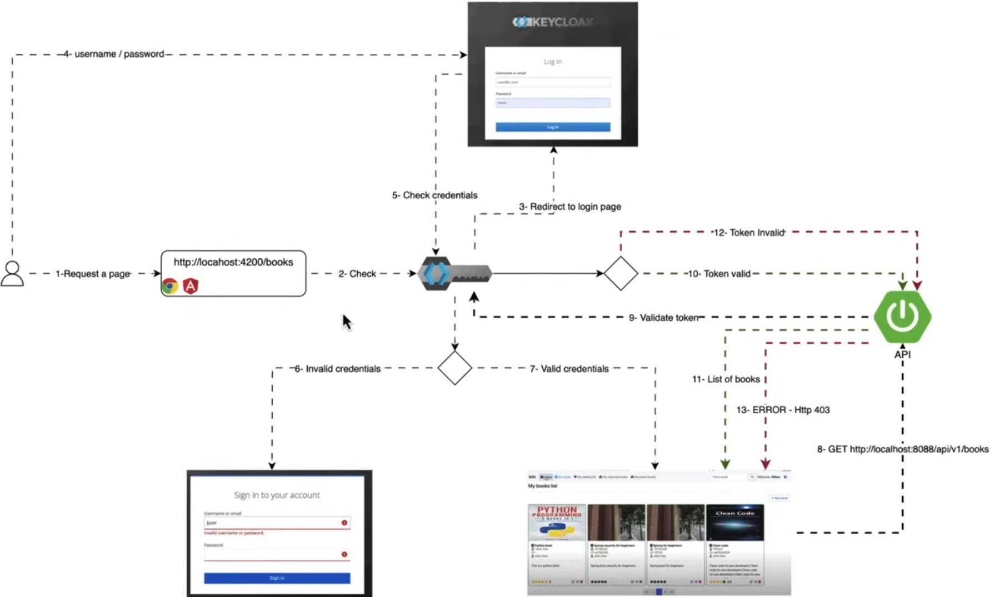

## Configura Keycloak con Docker

En nuestro `compose.yml` agregaremos el servicio para `keycloak`, de tal manera que cuando ejecutemos docker compose se
nos cree el contenedor de `Keycloak` a partir de su imagen. A continuación mostramos todo el contenido de nuestro
archivo `compose.yml` que incluye el servicio para `Keycloak`:

````yml
services:
  postgres:
    image: postgres:15.2-alpine
    container_name: c-postgres-bsn
    restart: unless-stopped
    environment:
      POSTGRES_DB: db_book_social_network
      POSTGRES_USER: magadiflo
      POSTGRES_PASSWORD: magadiflo
    ports:
      - 5435:5432
    volumes:
      - postgres_data:/var/lib/postgresql/data
    networks:
      - spring-net

  mail-dev:
    image: maildev/maildev
    container_name: c-mail-dev-bsn
    restart: unless-stopped
    ports:
      - 1080:1080
      - 1025:1025
    networks:
      - spring-net

  keycloak:
    image: quay.io/keycloak/keycloak:24.0.2
    container_name: c-keycloak-bsn
    restart: unless-stopped
    command:
      - 'start-dev'
    ports:
      - 8181:8080
    environment:
      KEYCLOAK_ADMIN: admin
      KEYCLOAK_ADMIN_PASSWORD: admin
    networks:
      - spring-net

volumes:
  postgres_data:
    name: postgres_data

networks:
  spring-net:
    name: spring-net
````

Una vez definido el servicio para `Keycloak` ejecutamos el siguiente comando para levantar todos los contenedores
definidos en el archivo `compose.yml`:

````bash
M:\PROGRAMACION\DESARROLLO_JAVA_SPRING\02.youtube\18.bouali_ali\08.full_web_application\book-social-network-03 (main -> origin)

$ docker compose up -d              
[+] Running 0/0                     
[+] Running 4/4ng-net  Creating     
 ✔ Network spring-net        Created
 ✔ Container c-postgres-bsn  Started
 ✔ Container c-mail-dev-bsn  Started
 ✔ Container c-keycloak-bsn  Started
````

Comprobamos que los contenedores se hayan creado y estén ejecutándose:

````bash
$ docker container ls -a
CONTAINER ID   IMAGE                              COMMAND                  CREATED          STATUS                      PORTS                                            NAMES
e10bcc43e07e   postgres:15.2-alpine               "docker-entrypoint.s…"   53 seconds ago   Up 52 seconds               0.0.0.0:5435->5432/tcp                           c-postgres-bsn
961d80ea53ac   maildev/maildev                    "bin/maildev"            53 seconds ago   Up 52 seconds (unhealthy)   0.0.0.0:1025->1025/tcp, 0.0.0.0:1080->1080/tcp   c-mail-dev-bsn
e1986d4225f0   quay.io/keycloak/keycloak:24.0.2   "/opt/keycloak/bin/k…"   53 seconds ago   Up 52 seconds               8443/tcp, 0.0.0.0:8181->8080/tcp                 c-keycloak-bsn
````

Ahora accedemos mediante el navegador al servidor de `Keycloak` autenticándonos con las credenciales definidas en el
archivo `compose.yml`. Luego de iniciar sesión seremos redireccionados al siguiente panel de administrador.

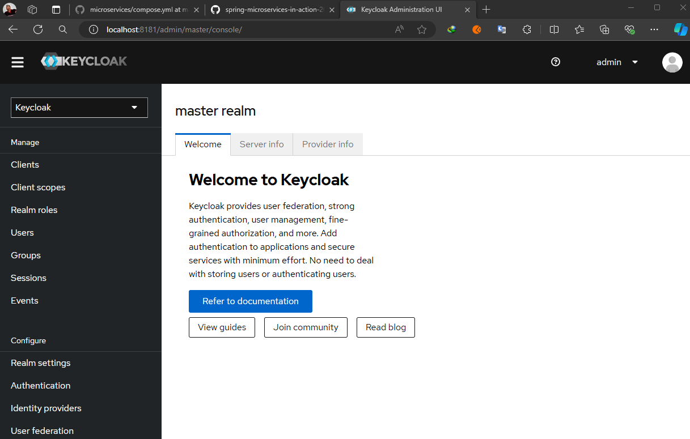

## Crea un nuevo realm y un client en Keycloak

Para crear un nuevo `realm` seguimos los pasos de la imagen de abajo. El nuevo `realm` que crearemos tendrá el nombre
de `book-social-network`.

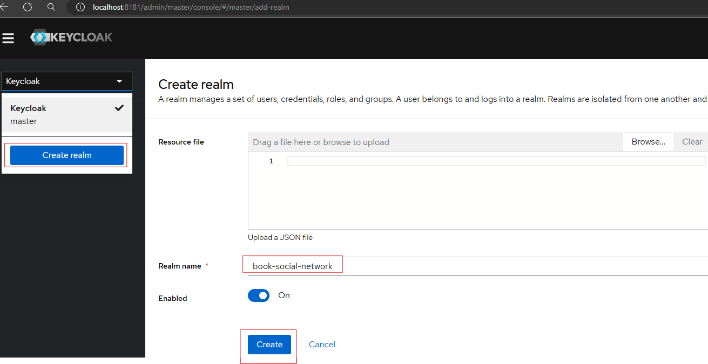

En la esquina superior izquierda seleccionamos el realm que acabamos de crear y luego en el menú del lateral izquierdo
seleccionamos `clients`, para crear un nuevo cliente.

El cliente que vamos a crear será para conectar nuestro frontend de `Angular` con el `realm`, así como también con
nuestro backend de `Spring Boot`.

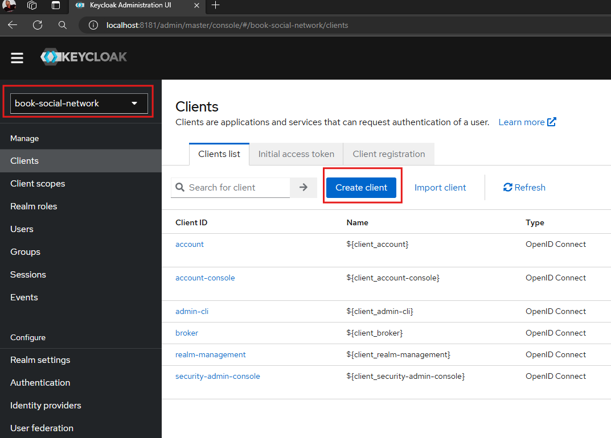

La siguiente imagen muestra las configuraciones generales que le vamos a dar a este cliente:

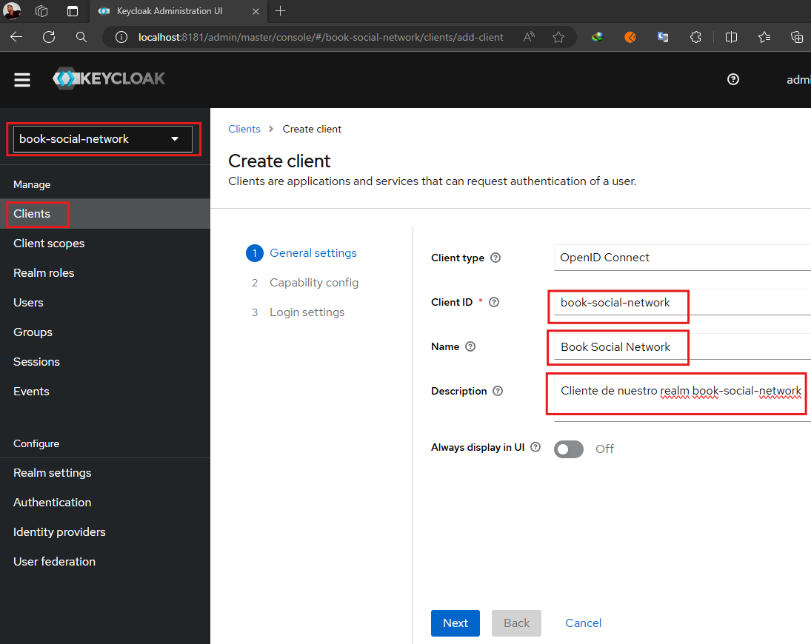

En la siguiente imagen dejamos todas las configuraciones por defecto:

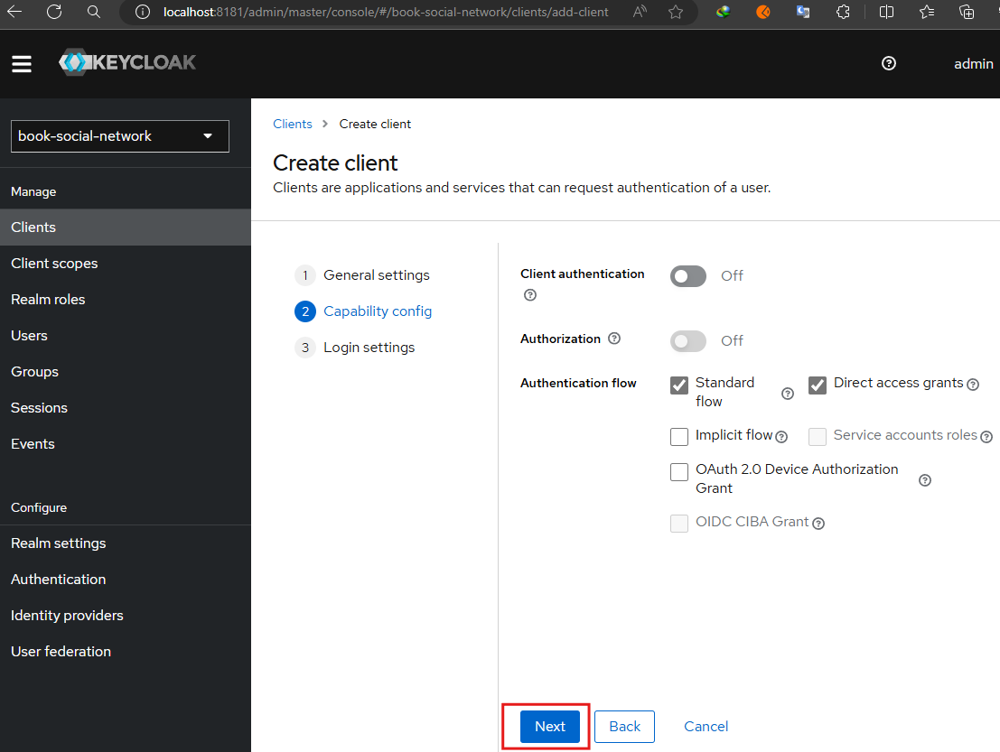

Finalmente, en la etapa de `Loging Settings` agregamos las urls según el campo solicitado:

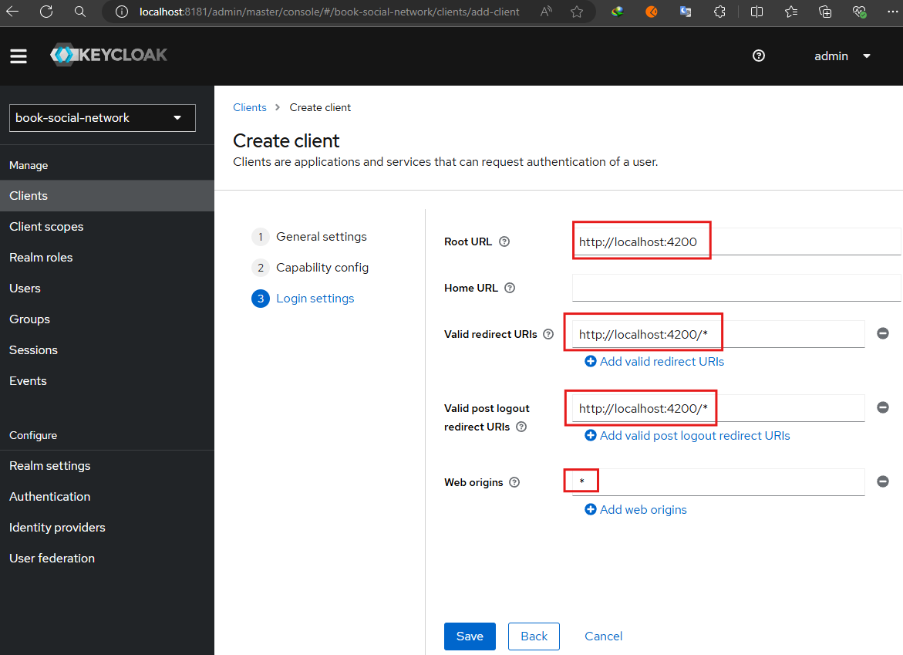

**DONDE**

- `Root URL`, debe ser la URL raíz de nuestra aplicación de frontend, en nuestro caso es `http://localhost:4200`.


- `Valid redirect URIs`, patrón de URI válido al que un navegador puede redirigir después de un inicio de sesión
  exitoso. Se permiten comodines simples como `http://example.com/*`. También se puede especificar la ruta relativa,
  como `/my/relative/path/*`. Las rutas relativas son relativas a la URL raíz del cliente o, si no se especifica
  ninguna, se utiliza la URL raíz del servidor de autenticación.


- `Valid post logout redirect URIs`, patrón de URI válido al que un navegador puede redirigir después de cerrar sesión
  correctamente. Un valor de `+` o un campo vacío utilizará la lista de uris de redireccionamiento válidos. Un valor
  de `-` no permitirá ningún URI de redireccionamiento posterior al cierre de sesión. Se permiten comodines simples
  como `http://example.com/*`. También se puede especificar la ruta relativa, como `/my/relative/path/*`. Las rutas
  relativas son relativas a la URL raíz del cliente o, si no se especifica ninguna, se utiliza la URL raíz del servidor
  de autenticación.


- `Web origins`, orígenes `CORS` permitidos. Para permitir todos los orígenes de URI de redireccionamiento válidos,
  agregue `+`. Sin embargo, esto no incluye el comodín `*`. Para permitir todos los orígenes, agregue
  explícitamente `*`.

Finalmente, veremos que nuestro cliente ha sido creado exitosamente.

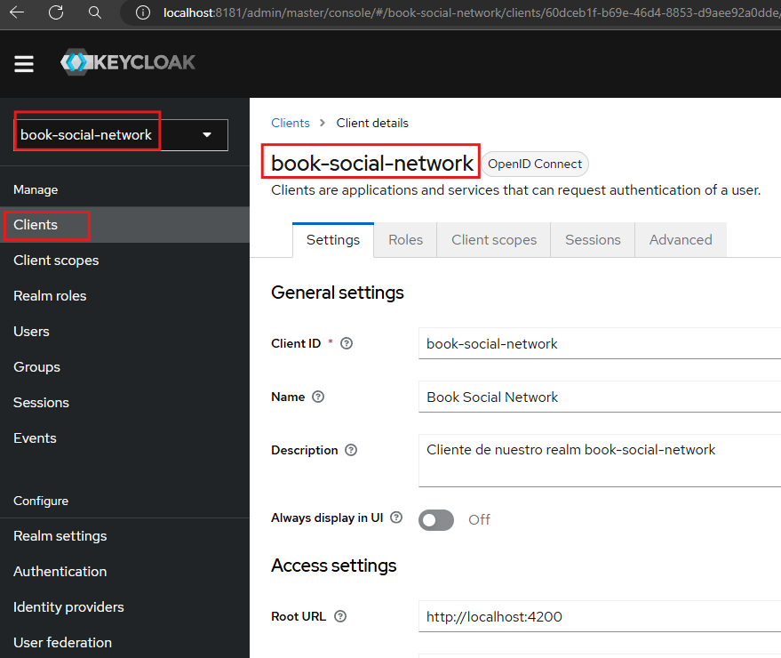

## Crea un usuario

Seleccionando el realm `book-social-network`, vamos a crear un usuario que lo usaremos más adelante.

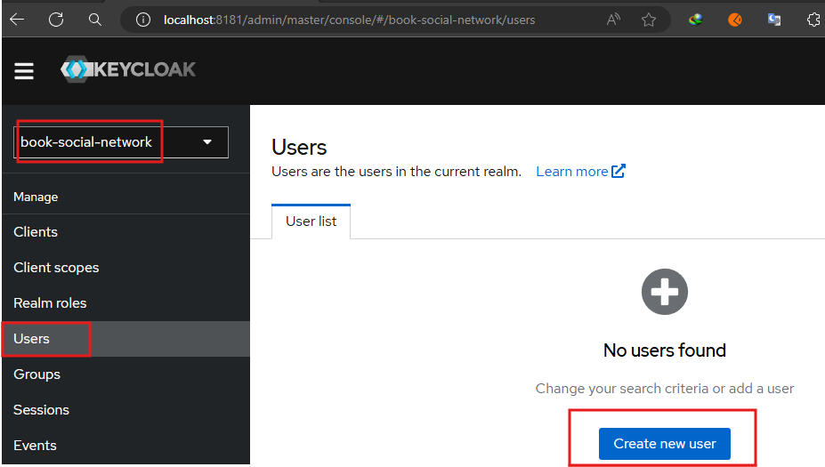

Crearemos el usuario tal como se ve en la imagen inferior. Este usuario solo nos servirá para mostrar el progreso
que vayamos realizando a nuestra aplicación. Nótese además que en el campo `email verified` estamos marcando como `Yes`
para decirle a `Keycloak` que el email del usuario lo coloque como un email verificado.

**¡Importante!**
> Nuestro objetivo final no es usar keycloak para crear usuarios, sino que queremos registrar usuarios a través de
> Keycloak

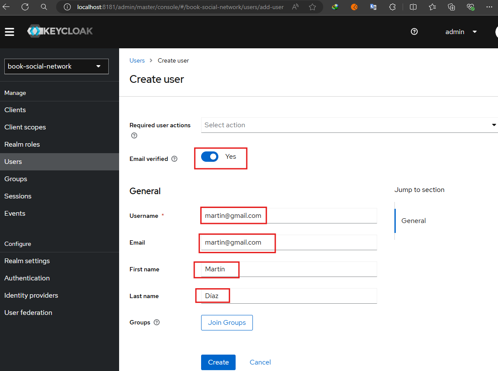

Una vez creado el usuario, seremos redireccionados a la siguiente página:

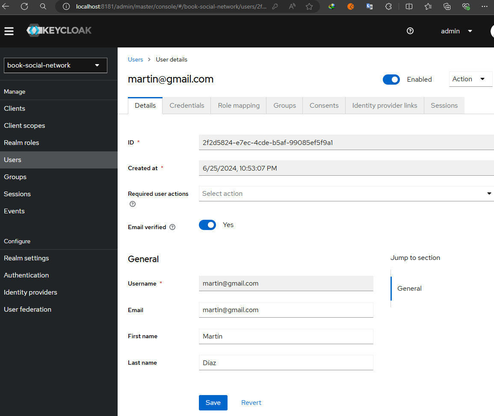

Ahora, iremos a la pestaña `Credentials` para asignarle una contraseña al usuario:

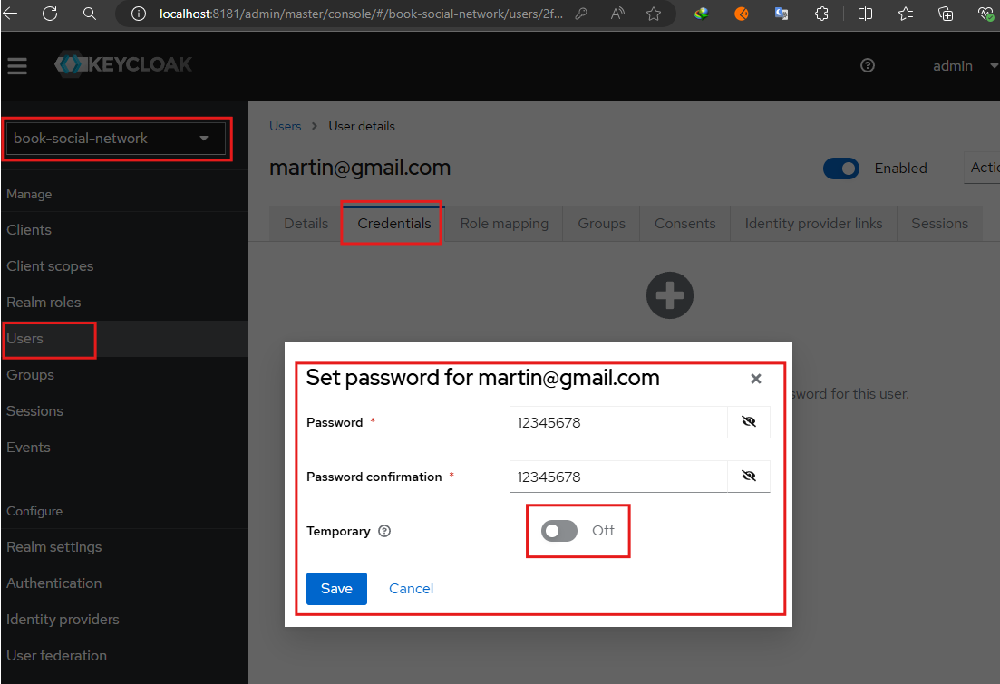

---

# Integrando Keycloak con Angular

---

## Instalando dependencia: keycloak-js

Agregaremos la siguiente dependencia `keycloak-js` a nuestra aplicación de Angular. **Esta dependencia es una
biblioteca JavaScript `OpenID Connect` del lado del cliente que se puede utilizar para proteger aplicaciones web.**

**¡Importante!**
> La versión de `keycloak-js` que debemos instalar debe ser la misma versión del servidor de `Keycloak` que estemos
> usando. En nuestro caso, recordemos que hemos dockerizado nuestro servidor de `Keycloack` y la versión que estamos
> usando es la `24.0.2`, por lo tanto, la dependencia `keycloak-js` que debemos instalar debe ser la misma.

````bash
M:\PROGRAMACION\DESARROLLO_JAVA_SPRING\02.youtube\18.bouali_ali\08.full_web_application\book-social-network-03\book-network-frontend (main -> origin)
$ npm i keycloak-js@24.0.2
````

## Crea y configura el servicio para keycloak

Crearemos el servicio `KeyclockService` a quien configuraremos para que se ejecute cuando arranque nuestra aplicación.
Al iniciar nuestra aplicación debemos decirle a Angular que tenemos un proveedor de autenticación, en nuestro
caso `Keycloack`, que queremos usar y que debe realizar todas las comprobaciones en dicho servidor.

````typescript
@Injectable({
  providedIn: 'root'
})
export class KeycloakService {

  async init() {
    console.log('Inicializando Keycloak');
  }

}
````

**DONDE**

- Notar que a la función `init()` le hemos antepuesto el `async`, con esto estamos indicando que es una función
  asíncrona. Más adelante utilizaremos el `await` dentro de la función `init` para interactuar con el servidor de
  keycloak.
- Al tener definida la función con `async`, la función se convierte automáticamente en una función que devuelve una
  `promesa`, independientemente de si utiliza `await` internamente o no. El uso de `await` dentro de la función
  simplemente permite manejar otras promesas de manera más legible.
- Si la función `async` retorna un valor, ese valor se convierte en la resolución de la promesa.
- Si una función `async` no retorna explícitamente un valor, la promesa que se resuelve tendrá un valor de `undefined`,
  lo que en términos prácticos equivale a `void`.
- Si la función `async` lanza una excepción, esa excepción se convierte en el rechazo de la promesa.

## ¿Qué es APP_INITIALIZER?

`Angular` viene con un token `APP_INITIALIZER`, lo que permite a los desarrolladores ejecutar algún código antes de que
la aplicación comience a ejecutarse. Proporciona una forma de cargar datos, realizar la autenticación o configurar el
entorno de la aplicación antes de que la aplicación se represente en el explorador.

`Angular` **ejecuta la función asociada con un token durante la carga de la aplicación. Si la función devuelve una
promesa, Angular esperará a que la promesa se resuelva antes de inicializar la aplicación. Esto lo convierte en un
lugar ideal para ejecutar la lógica de inicialización.**

El token `APP_INITIALIZER` se define como proveedor en el módulo `@angular/core`. Toma una función como argumento y
devuelve un `Promise` o un `Observable`. Cuando se inicia la aplicación, `Angular` invoca al proveedor `APP_INITIALIZER`
y espera a que se resuelva la promesa o el observable antes de renderizar la aplicación.

Para utilizar `APP_INITIALIZER` en la aplicación, debe definir una función que realice las tareas de inicialización y
devuelva un `Promise` u `Observable`. Por ejemplo, en nuestro caso, deseamos comprobar usando kecyclock si un usuario
está autenticado o no antes de que inicie la aplicación. Puede definir un proveedor de `APP_INITIALIZER` en el
archivo `app.config.ts` (para Angular clásico sería en el archivo `app.module.ts`) de la siguiente manera:

````typescript
export function initialize(kcService: KeycloakService) {
  return () => kcService.init();
}

export const appConfig: ApplicationConfig = {
  providers: [
    provideRouter(APP_ROUTES),
    provideHttpClient(withInterceptors([httpTokenInterceptor])),
    {
      provide: APP_INITIALIZER,
      useFactory: initialize,   //<-- Define el método initialize
      deps: [KeycloakService],  //<-- Dependencias que serán inyectadas al método initialize()
      multi: true,
    }
  ]
};
````

**DONDE**

- `multi: true`, esto indica que puede haber múltiples inicializadores registrados. Angular ejecutará todas las
  funciones de inicialización y esperará a que todas las promesas u observables se resuelvan antes de continuar con la
  inicialización de la aplicación.
- `useFactory`, permite especificar una función de fábrica que crea la función de inicialización. Esto es útil para
  inyectar servicios en la función de inicialización.

Con la configuración anterior, cuando se inicie la aplicación, `Angular` invocará la función `initialize` a quien le
estamos pasando o inyectando como `deps (dependencias)` la clase `KeycloakService`. El método `initialize` utilizará
el método `init()` del servicio inyectado antes de renderizar la aplicación.

## Configuración inicial de keycloak con Angular

En este apartado vamos a configurar la clase de servicio `KeycloakService` que creamos en el apartado anterior. Vamos
a crear una instancia de `Keycloak` y definirle parámetros de conexión para que se conecte al servidor.

````typescript
import { Injectable } from '@angular/core';

import Keycloak from 'keycloak-js';

@Injectable({
  providedIn: 'root'
})
export class KeycloakService {

  private _keycloak: Keycloak | undefined;

  public get keycloak(): Keycloak {
    if (!this._keycloak) {
    
      // Creando la instancia de Keycloak
      this._keycloak = new Keycloak({
        url: 'http://localhost:8181',
        realm: 'book-social-network',
        clientId: 'book-social-network'
      });
      
    }
    return this._keycloak;
  }

  async init() {
    console.log('Autenticando al usuario...');
    const authenticated = await this.keycloak.init({
      onLoad: 'login-required',
    });

    if (authenticated) {
      console.log('¡Usuario autenticado!');
    }
  }

}
````

**DONDE**

- En el método `get` estamos creando la instancia de `Keycloak`. La creación de esa instancia sigue el patrón Singletón,
  de tal forma que si ya tenemos la instancia creada, simplemente la reutilizamos.
- Cuando creamos la instancia `new Keycloak({...})`, le pasamos un objeto con tres parámetros.
    - La `url`, es la URL del servidor de keycloak.
    - El `realm`, es el nombre del realm al que nos conectaremos y es el que creamos en el servidor de Keycloak en
      un apartado superior.
    - El `clientId`, es el identificador del cliente. En nuestro caso, en el servidor de Keycloak, dentro del realm
      anterior creamos un cliente con el siguiente identificador `book-social-network`.


- En el método `init()` estamos haciendo uso de la instancia creada en el método `get`. Utilizamos el `await` para
  esperar a que se resuelva el método `init()` de la instancia de keycloak. Este método recibe un objeto con un
  atributo `onLoad` (aunque tiene más atributos), pero usaremos únicamente el `onLoad` como configuración mínima
  requerida.
- `onLoad`, especifica una acción a realizar al cargar. En nuestro caso definimos el tipo `login-required`, permite
  verificar si ya se ha iniciado sesión o no. Hay otro valor que se puede colocar que es `check-sso`, podemos configurar
  un inicio de sesión único para diferentes aplicaciones.
- Finalmente, utilizamos una condición para verificar si el usuario se ha autenticado o no.

## Probando configuración inicial de Keycloak con Angular

## Con credenciales correctos

Vamos a abrir un navegador e ingresar a nuestra aplicación de Angular.

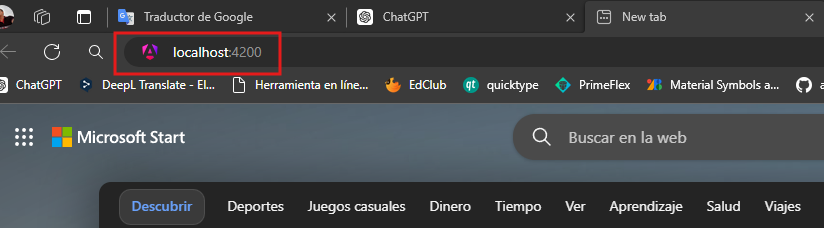

Al dar `enter` para ingresar a nuestra aplicación de `Angular`, seremos redireccionados al `login de keycloak`. Aquí
debemos usar el usuario que creamos para este cliente. Recordemos lo que decía en el apartado `Crea un usuario`,
que solo estábamos creando a este usuario para realizar las pruebas y aquí lo estamos usando.

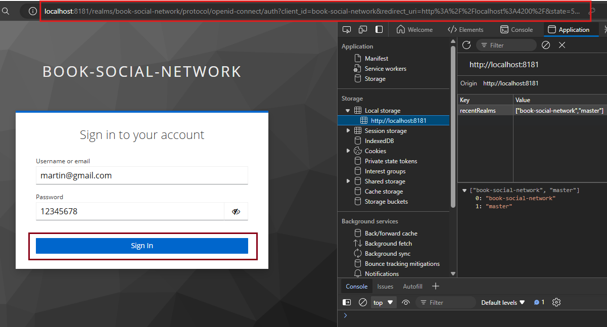

Luego de iniciar sesión de manera exitosa, keycloak nos redirecciona a nuestra aplicación de Angular.

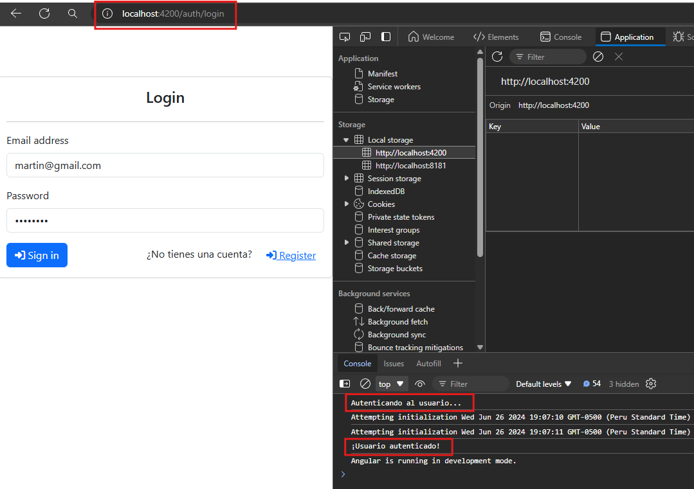

Nótese los mensajes que se muestran en consola, eso nos indica que la configuración que establecimos entre keycloak y
nuestra aplicación de Angular está funcionando correctamente.

## Finalizar sesión de usuario

Si por alguna razón queremos finalizar la sesión del usuario `martin@gmail.com` debemos ingresar al panel de
administración del servidor de keycloak con las credenciales username: `admin` y password: `admin` para terminar la
sesión de manera manual, tal como se ve en la siguiente imagen:

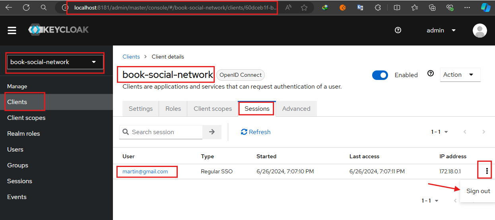

## Con credenciales incorrectos

Vamos a realizar nuevamente el flujo, pero esta vez usaremos credenciales incorrectos para ver cómo se
comporta el login de keycloak:

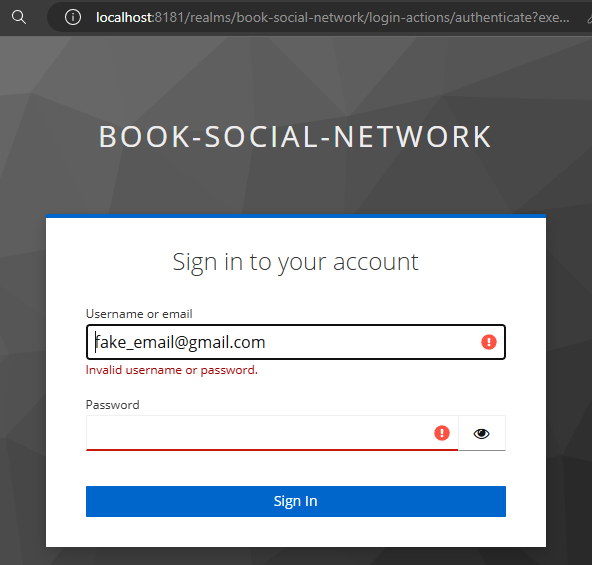

Como observamos, el usuario ingresado no existe, por lo tanto, nos muestra los mensajes de errores correspondientes.

## Finaliza implementación de KeycloakService

Creamos una clase de modelo donde definiremos atributos para el perfil de usuario con el que trabajaremos en la
aplicación.

````typescript
//book-network-frontend\src\app\keycloak\models\user-profile.model.ts

export interface UserProfile {
  username?: string;
  email?: string;
  firstName?: string;
  lastName?: string;
  token?: string;
}
````

Ahora, finalizamos la implementación de nuestra clase de servicio `KeycloakService` agregando métodos como el `login()`,
`logout()`, `profile()` y utilizando la clase de modelo `UserProfile` para almacenar la información que nos proporciona
`Keycloak` sobre el usuario autenticado.

````typescript
import { Injectable } from '@angular/core';
import Keycloak from 'keycloak-js';
import { UserProfile } from './models/user-profile.model';

@Injectable({
  providedIn: 'root'
})
export class KeycloakService {

  private _keycloak: Keycloak | undefined;
  private _profile: UserProfile | undefined;

  public get keycloak(): Keycloak {
    if (!this._keycloak) {

      this._keycloak = new Keycloak({
        url: 'http://localhost:8181',
        realm: 'book-social-network',
        clientId: 'book-social-network'
      });

    }
    return this._keycloak;
  }

  public get profile(): UserProfile | undefined {
    return this._profile;
  }

  async init(): Promise<void> {
    console.log('Autenticando al usuario...');
    const authenticated = await this.keycloak.init({
      onLoad: 'login-required',
    });

    if (authenticated) {
      console.log('¡Usuario autenticado!');
      this._profile = (await this.keycloak.loadUserProfile()) as UserProfile;
      this._profile.token = this.keycloak.token || '';
    }
  }

  public login(): Promise<void> {
    return this.keycloak.login();
  }

  public logout(): Promise<void> {
    return this.keycloak.logout({
      redirectUri: 'http://localhost:4200'
    });
  }
}
````

Observemos que utilizando el siguiente código podemos obtener el token de acceso:

````typescript
this.keycloak.token
````

Si quisiéramos acceder a la información parseada del token, podríamos usar este código:

````typescript
this.keycloak.tokenParsed
````

Finalmente, observemos el método `logout()`, internamente usa la instancia de keycloak y llama a su propio método
llamado `logout()`, este método podríamos haberlo dejado sin el parámetro del `redirectUri`, ya que lo tenemos
configurado en el servidor de Keycloak, allí definimos como uri de redirección la misma uri que pasamos a este método.
Pero lo estamos colocando únicamente para ver que también podemos usar esta otra forma, de esa manera podemos tener
a la mano más opciones de configuración.

## Integrando KeycloakService con Guards

Anteriormente, ya habíamos creado los Guards, así que vamos a modificarlos para inyectar el `KeycloakService`:

````typescript
import { inject } from '@angular/core';
import { CanActivateFn, CanMatchFn, Router } from '@angular/router';

import { KeycloakService } from '../keycloak/keycloak.service';

export const canMatchAuthGuard: CanMatchFn = (route, segments) => {
  console.log('Ejecutnado canMatchAuthGuard()');
  return checkAuthStatus();
}

export const canActivateAuthGuard: CanActivateFn = (route, state) => {
  console.log('Ejecutnado canActivateAuthGuard()');
  return checkAuthStatus();
};

const checkAuthStatus = () => {
  const keycloakService = inject(KeycloakService);
  const router = inject(Router);

  if (keycloakService.keycloak.isTokenExpired()) {
    router.navigate(['/auth', 'login']);
    return false;
  }

  return true;
}
````

## Integrando KeycloakService con los interceptores

Al igual que hicimos con el guard, haremos lo mismo con el interceptor. Ahora trabajaremos con el `KeycloakService`:

````typescript
import { HttpInterceptorFn } from '@angular/common/http';
import { inject } from '@angular/core';

import { KeycloakService } from '../keycloak/keycloak.service';

export const httpTokenInterceptor: HttpInterceptorFn = (req, next) => {
  const keycloakService = inject(KeycloakService);
  const token: string | undefined = keycloakService.keycloak.token;

  let reqClone = req;

  if (token) {
    reqClone = req.clone({
      headers: req.headers.set('Authorization', `Bearer ${token}`)
    });
  }

  return next(reqClone);
};
````

## Modificando otros componentes para trabajar con KeycloakService

Vamos a modificar el componente `MenuComponente`, ya que inicialmente estábamos trabajando con el `TokenService`, pero
ahora trabajaremos con `KeycloakService`.

````typescript
@Component({
  selector: 'books-menu',
  standalone: true,
  imports: [RouterLink, RouterLinkActive, SlicePipe],
  templateUrl: './menu.component.html',
  styleUrl: './menu.component.scss'
})
export class MenuComponent {

  private _keycloakService = inject(KeycloakService);

  //* Agregamos el async, ya que los métodos que llamamos desde el keycloakService son métodos asíncronos
  async logout(): Promise<void> {
    this._keycloakService.logout();
  }

  public get fullName(): string {
    return this._keycloakService.profile?.firstName || '';
  }

}
````

Finalmente, modificamos el componente `AuthLoginPageComponent`, donde implementamos el método `ngOnInit()` para llamar
a los métodos asíncronos del servicio `KeycloakService`.

Observar que al método `ngOnInit()` le he colocado el `async`, eso es porque como dice el comentario, los métodos a los
que llamamos son métodos asíncronos.

````typescript
@Component({
  selector: 'auth-login-page',
  standalone: true,
  imports: [],
  templateUrl: './auth-login-page.component.html',
  styleUrl: './auth-login-page.component.scss'
})
export class AuthLoginPageComponent implements OnInit {

  private _keycloakService = inject(KeycloakService);

  //* Agregamos el async, ya que los métodos que llamamos desde el keycloakService son métodos asíncronos
  async ngOnInit(): Promise<void> {
    await this._keycloakService.init();
    await this._keycloakService.login();
  }

}
````

Con respecto al component html del `AuthLoginPageComponent`, eliminamos todas las etiquetas de dicho componente, ya que
ahora el login lo mostrará el servidor `Keycloak`.

---

# Integrando Keycloak con Spring Boot

---

## Modificando dependencias y propiedades de configuración

Actualmente, tenemos a `Keycloak` como nuestro servidor de Authorization. Ahora, necesitamos agregar la dependencia a
nuestro backend para que se convierta en nuestro servidor de recursos, por lo tanto, necesitamos agregar la dependencia
de `spring-boot-starter-oauth2-resource-server`:

````xml

<dependency>
    <groupId>org.springframework.boot</groupId>
    <artifactId>spring-boot-starter-oauth2-resource-server</artifactId>
</dependency>
````

Recordar que en este proyecto veníamos trabajando con la dependencia de `Spring Security`, misma que debemos quitar
de las dependencias del `pom.xml`, dado que la nueva dependencia agregada del `resource server` ya la trae internamente
consigo.

Otra modificación que haremos será en el `application-dev.yml`. Quitaremos las siguientes configuraciones, ya que ahora
la emisión del jwt lo manejará el Authorization Server. Del mismo modo no necesitamos la url de activación, porque
nuevamente, el registro del usuario lo maneja el servidor de autorización.

````yml
#security:
#  jwt:
#    secret-key: jNFY9S0YoLZ9xizq2V8FG5yMudcZpBKXyLQjSWPbiX8jNFY9S0Y
#    expiration: 3600000
#mailing:
#  frontend:
#    activation-url: http://localhost:4200/auth/activate-account
````

Lo que sí debemos agregar es la siguiente configuración:

````yml
spring:
  security:
    oauth2:
      resourceserver:
        jwt:
          issuer-uri: http://localhost:8181/realms/book-social-network
````

La url que se colocó en `issuer-uri` se obtuvo del servidor de autorización. Si vamos a `Keycloak`, seleccionamos
nuestro realm `book-social-network`, luego ingresamos en el apartado de `Realm settings`, en la parte derecha
seleccionamos la pestaña `General` y en la parte inferior habrá una opción de `Enpoints` donde mostrará el enlace
`OpenID Endpoint Configuration`, damos clic y observaremos que se nos abre la siguiente página con una respuesta json:

`http://localhost:8181/realms/book-social-network/.well-known/openid-configuration`

````bash
{
    "issuer": "http://localhost:8181/realms/book-social-network",
    "authorization_endpoint": "http://localhost:8181/realms/book-social-network/protocol/openid-connect/auth",
    "token_endpoint": "http://localhost:8181/realms/book-social-network/protocol/openid-connect/token",
    "introspection_endpoint": "http://localhost:8181/realms/book-social-network/protocol/openid-connect/token/introspect",
    "userinfo_endpoint": "http://localhost:8181/realms/book-social-network/protocol/openid-connect/userinfo",
    "end_session_endpoint": "http://localhost:8181/realms/book-social-network/protocol/openid-connect/logout",
    "frontchannel_logout_session_supported": true,
    "frontchannel_logout_supported": true,
    "jwks_uri": "http://localhost:8181/realms/book-social-network/protocol/openid-connect/certs",
    "check_session_iframe": "http://localhost:8181/realms/book-social-network/protocol/openid-connect/login-status-iframe.html",
    "grant_types_supported": [
        "authorization_code",
        "implicit",
        "refresh_token",
        "password",
        "client_credentials",
        "urn:openid:params:grant-type:ciba",
        "urn:ietf:params:oauth:grant-type:device_code"
    ],
    ...
}
````

Si observamos la primera propiedad `issuer`, esta contiene la url que colocamos en el `application-dev.yml`.